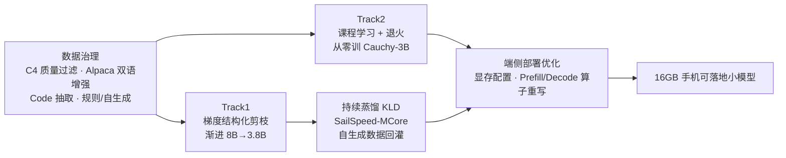

import Figure from '../../components/Figure.astro';

> - **核心贡献**：代表腾讯 AI Platform Dept.（队名 **Tinytron**）参加 **NeurIPS 2024 Edge-Device LLM Competition**，**Track1（压缩）与 Track2（从零预训练）双双夺得第一名**。
> - **核心业绩**：在「16GB 手机、限定数据源（C4 / Alpaca）、限定 teacher」的硬约束下，交付两条完整技术路线——**Track1（压缩）** 以梯度结构化剪枝 + 持续蒸馏将 Llama-3.1-8B-Instruct 渐进压缩至 **3.8B**；**Track2（从零预训练）** 以课程学习 + 学习率退火高效预训练出 **Cauchy-3B**；并在 **mlc-llm / TVM** 栈上为 **Maleoon 910** 移动 GPU 重写 Prefill / Decode 矩阵算子、压缩端侧显存占用。
> - **产出 & 价值**：**满分 120 分下，Track1 取得 119 分、Track2 取得 112 分（两赛道第二名均在 105 分以下），均以显著优势夺冠**；形成一套可复现的「数据治理 → 剪枝 / 预训练 → 蒸馏恢复 → 端侧部署优化」端侧小模型全链路方法论，并完成模型、代码与技术报告的开源发布。

> 🏆 **评分规则（满分 120 分）**：10 个评测任务（8 公开 + 2 隐藏，MMLU / C-Eval）各 10 分、推理性能 20 分。每个单项按排名计分——某任务第一名得 10 分、第二名 9 分，以此递减；推理性能第一名 20 分、第二名 18 分、第三名 16 分。**Track1 119 / 120、Track2 112 / 120**。

> 📄 **完整技术报告（Notion，含全部实验细节、公式与原始图表）**：[Tinytron Technical Report](https://boom-modem-1cc.notion.site/Tinytron-Technical-Report-15d780ce977a8090a988fd8fd796b3c3)
>
> 🤗 [HuggingFace · Tinytron](https://huggingface.co/Tinytron) ｜ 💻 [GitHub · Tinytron](https://github.com/orgs/Tinytron/repositories)

---

# 背景与赛题

## 竞赛与赛题

**Edge-Device LLM Competition @ NeurIPS 2024**：目标是在 **16GB 内存的手机**上交付尽可能强的小模型，既要在评测任务上拿高分，又要满足端侧的**显存占用**与**推理延迟（prefill / decode tokens/s）** 约束。竞赛设两条赛道：

- **Track1（压缩）**：将 `Llama-3.1-8B-Instruct` / `Qwen2-7B-Instruct` / `Phi-2` 适配到手机部署；
- **Track2（从零预训练）**：在限定数据与算力内从头训练小模型。

**评测任务**：Commonsense QA、FewCLUE-chid（中文成语完形）、HumanEval（代码）、GSM8K（数学）、TruthfulQA、BigBench-Hard（27 项），以及赛后揭晓的隐藏任务 **MMLU / C-EVAL**。允许的公开数据集仅 **C4** 与 **Alpaca**。

**评分规则与名次（满分 120 分）**：10 个评测任务各 10 分、推理性能 20 分，合计 120 分。各单项按排名计分（任务第一名 10 分、第二名 9 分……；推理性能 20 / 18 / 16 递减）。最终：

- **Track1（压缩赛道）：第一名，119 / 120**（第二名 < 105）。
- **Track2（从零预训练赛道）：第一名，112 / 120**（第二名 < 105）。

> 两条赛道均以显著优势夺得第一名。下文先给出**成绩总览**，再依次展开 **Track1 压缩路线**、**Track2 从零预训练（Cauchy-3B）** 与**端侧系统优化**。

---

# 成绩总览：最终模型 vs 基线 vs 业界参考

下表汇总最终提交模型在评测任务上的表现，并与团队 10 月的基线版本、以及业界参考模型（SOTA 稀疏化模型、官方 Llama-3.2 系列）对照。**EdgeLLM (Public)** 为竞赛 8 个公开任务的均分，**EdgeLLM (Eval)** 为含 2 个隐藏任务（MMLU / C-Eval）的官方评测均分。

| 模型 | 参数量 | 训练 token | **EdgeLLM (Public)** | **EdgeLLM (Eval)** |
|---|---|---|---|---|
| **Track1 · Llama-3.8B-Tinytron**（终版） | 3.8B | 324B | **57.01** | **55.41** |
| **Track1 · Qwen-3.9B-Tinytron**（终版） | 3.9B | 205B | 55.96 | 55.05 |
| **Track1 · Phi-2-Tinytron**（终版） | 2.9B | 78B | 46.48 | 45.87 |
| Track1 · 三压缩模型均分（终版） | — | — | 53.15 | 52.11 |
| **Track2 · Cauchy-3B**（终版） | 3.0B | 221B | 15.88 | 18.79 |
| Track1 · Llama-preview（10 月基线） | 4.3B | 95B | 40.91 | 42.72 |
| Track1 · Qwen-preview（10 月基线） | 3.9B | 137B | 44.28 | 46.15 |
| Track1 · Phi-2 原版（10 月基线） | 2.7B | — | 44.56 | 43.67 |
| Track1 · 三模型均分（10 月基线） | — | — | 43.25 | 44.18 |
| 业界参考 · Sparse-Llama-3.1-8B-2of4 | 8B(2:4) | 13B | 53.34 | 53.44 |
| 业界参考 · Llama-3.2-1B-Instruct | 1.2B | 9000B | 38.99 | 40.07 |
| **业界参考 · Llama-3.2-3B-Instruct** | 3.2B | 9000B | **56.49** | **56.09** |

> **一句话读图**：Track1 终版 **Llama-3.8B-Tinytron（57.01 / 55.41）领先全部 Track1 模型**，较 10 月基线（三模型均分 43.25 → 53.15）大幅提升；在仅 324B 训练 token 下即逼近用 9000B token 训练的官方 **Llama-3.2-3B-Instruct（56.49 / 56.09）**，并全面超过更大体量的 SOTA 稀疏模型 **Sparse-Llama-3.1-8B-2of4（53.34 / 53.44）**。

**Track1 三个压缩模型的逐任务细则**（终版；展开查看各 benchmark 分数）：

| 任务（机构 / 领域） | Llama-3.8B 终版 | Qwen-3.9B 终版 | Phi-2 终版 |
|---|---|---|---|
| CommonsenseQA（AllenAI / 常识） | 72.40 | 64.37 | 47.09 |
| FewCLUE-chid（CLUE / 成语） | 63.64 | 74.48 | 34.87 |
| HumanEval（OpenAI / 代码） | 40.24 | 37.80 | 49.39 |
| GSM8K（OpenAI / 数学） | 63.31 | 58.23 | 59.44 |
| TruthfulQA（真实性） | 0.29 | 0.28 | 0.23 |
| BigBench-Hard（综合推理 CoT） | 44.47 | 44.57 | 41.84 |
| MMLU（英文学科） | 58.57 | 57.70 | 54.32 |
| C-Eval（中文学科） | 42.67 | 46.92 | 33.74 |
| ARC-c（科学推理） | 80.68 | 73.90 | 74.58 |
| HellaSwag（常识推断） | 61.92 | 67.75 | 49.79 |
| WinoGrande（指代消解） | 57.54 | 55.56 | 57.85 |
| IFEval（指令遵循） | 59.91 | 47.39 | 41.69 |

> 注：上表为最终提交模型的原始分数（来自竞赛官方榜单导出）；TruthfulQA 按官方口径以小数计，其余为百分制。Track2 的 Cauchy-3B 为从零训练模型，与压缩模型不在同一对照口径，其逐任务表现见下文 Track2 章节。完整含「相对原模型得分比」与全部模型对照见 [Notion 技术报告 §3.5](https://boom-modem-1cc.notion.site/Tinytron-Technical-Report-15d780ce977a8090a988fd8fd796b3c3)。

- **Track1 终版 Llama-3.8B 优于全部 Track1 模型**（含加自生成数据的 Qwen-3.9B）。相较 10 月基线（4.3B Llama 仍落后于 3.9B Qwen）是结构性改进：表明算力充足时，**渐进式剪枝蒸馏在更高稀疏度下仍能取得更优性能**。
- 对照 SOTA 半结构化稀疏模型 `Sparse-Llama-3.1-8B-2of4`：Llama-3.8B-Tinytron 在**更高压缩率**下于各下游任务取得更优泛化；作为结构化剪枝模型，更利于通用加速。
- 对照官方 `Llama-3.2-3B-Instruct`：在 OOD 任务上仍存在差距，判断主要源于竞赛对数据源的限制（仅可用 C4 / Alpaca 与剪枝模型自生成数据），训练 token 量亦相差约一个数量级。

---

# 第一部分 · Track1（压缩赛道）：剪枝 + 持续蒸馏

## 1. 数据治理：质量 vs 数量

竞赛仅允许 C4 与 Alpaca，因此数据治理直接决定能力上限。

- **C4-English（质量过滤）**：用 DCLM 流水线 + 开源 fastText 分类器 `fasttext-oh-eli5` 给 305GB 语料打质量分。对比不同阈值后，确定取 **Top 10%（阈值 0.082）** 优于 Top 20% 与 Top 5%。

<Figure
  src="/edgellm-tinytron/c4-quality-dist.png"
  alt="C4-English 质量分分布"
  caption="<i>Figure 1</i>：C4-English 文档质量分的分位分布（fastText 预测为正类的概率，x 轴 800–1000 即 Top 20%）。"
/>

| C4 取用比例 | Commonsense QA | FewCLUE-chid | HumanEval | GSM8K | TruthfulQA | BBH | **均分** |
|---|---|---|---|---|---|---|---|
| Top 5% | 29.07 | 19.33 | 1.83 | 17.06 | 0.220 | 21.24 | 18.43 |
| **Top 10%** | 42.01 | 16.63 | 3.66 | 12.21 | 0.238 | 25.74 | **20.67** |
| Top 20% | 32.92 | 19.68 | 3.66 | 9.40 | 0.260 | 23.68 | 19.22 |

> 实验设置：以剪枝至 3.7B 的 Llama-3.1-8B-Instruct、2.15B token 训练量为基准，仅改变 C4 质量阈值。

- **Alpaca（双语增强）**：原始 52k 过小，重组为非冗余的**双语 QA 对**（Type1，互译 + 随机目标语应答）与**数学/代码多轮对话**（Type2，上采样 10×）。对照实验确定 **10% Bilingual 配比最优**，且双语增强（均分 19.07）显著优于原始 Alpaca（17.51）。
- **Code（从 C4 正则抽取）**：以 `def`/`class`/`import` 及 stackoverflow / github 域名抽取代码相关文本。对照确定 **4.76% 配比最优**（均分 21.28 > 不加的 20.67）。
- **蒸馏最终配比**：`C4-Top10% : Bilingual : Code = 90 : 10 : 5`。

## 2. 剪枝：用蒸馏梯度求解剪枝掩码

借鉴 **Sheared LLaMA** 的 **Targeted Structured Pruning**：为每个 head / layer / hidden / intermediate 维护一个 0–1 掩码变量，**权重与掩码联合优化**；关键差异是**仅用对 teacher logits 的 KLD Loss**（不使用 next-token 的 one-hot 交叉熵），梯度更准、对噪声更鲁棒，引导剪枝模型快速恢复能力。

### 2.1 渐进式剪枝（Progressive Pruning）

一次性剪到目标尺寸会导致能力骤降（实验中 Llama 一步剪到 4.3B、蒸馏 100B token，最高均分仅 36.18 / 55.55%）。因此采用**多轮渐进剪枝 + 每轮后持续蒸馏恢复**：`8B → 6.8B → 6.3B → 4.6B → 3.8B`。

<Figure
  src="/edgellm-tinytron/llama-multiround.png"
  alt="Llama3.1 多轮压缩流程"
  caption="<i>Figure 4</i>：Llama3.1-8B-Instruct 四轮渐进剪枝，每轮后蒸馏恢复，收敛后再进入下一轮。"
/>

| 结构参数 | 8B（原始） | 6.8B | 6.3B | 4.6B | 3.8B |
|---|---|---|---|---|---|
| 独立 lm_head | True | True | **False** | False | False |
| NUM_LAYERS | 32 | 32 | 32 | **30** | 30 |
| HIDDEN_SIZE | 4096 | 4096 | 4096 | **3584** | **3072** |
| FFN_HIDDEN_SIZE | 14336 | **11264** | 11264 | **9856** | 9856 |
| ATTN_HEAD_SIZE | 128 | 128 | 128 | 112 | **96** |

> 两处关键设计：**6.8B→6.3B** 通过共享 embedding 与 lm_head（如 Qwen2.5≤3B / MiniCPM）；**4.6B→3.8B** 经实验确认**缩小 attention head size 比减少 head 数量更有效**。

<Figure
  images={[
    { src: '/edgellm-tinytron/headsize-vs-heads.png', label: 'head size vs head 数' },
    { src: '/edgellm-tinytron/lr-vs-size.png', label: '学习率 × 模型尺寸' },
  ]}
  cols={2}
  alt="结构与学习率消融"
  caption="左（<i>Figure 5</i>）：压到 5.8B 时，缩小 ATTN_HEAD_SIZE（128→96，蓝）优于减少 head 数（32→24，橙）。右（<i>Figure 6</i>）：剪枝模型越大越需要小学习率，越小越需要大学习率——大模型权重微调即可，过大的学习率会使权重过快适应随机掩码初始化，导致性能急剧下降。"
/>

### 2.2 持续预训练（蒸馏）与 SailSpeed-MCore

剪枝掩码稳定后执行确定剪枝，再切换到内部 **SailSpeed-MCore**（基于 Megatron-Core 扩展）做计算高效的持续预训练（蒸馏）。其支持 **Hybrid（师生同设备串行）** 与 **Separate（师生分设备并行）** 两种部署模式，以适配不同师生尺寸与算力（含 Dense 与 MoE）。

### 2.3 剪枝模型自生成数据（闭环）

在与组委会确认合规后，建立**自生成数据流水线**：用「最近一次压缩后的模型」批量生成并校验 CodeExercises / 数学应用题 / 成语完形等领域指令数据，回灌蒸馏。该闭环离线迭代进行，持续缩小 student 当前能力与目标数据的差距。

<Figure
  src="/edgellm-tinytron/selfgen-workflow.png"
  alt="剪枝模型自生成指令数据流程"
  caption="<i>Figure 9</i>：用剪枝模型自生成指令数据集——配置类目/难度 → 采样 → 构造 prompt → 调用端点 → 校验/重试 → 生成解答 → 入库 → 迭代。"
/>

## 3. Track1 实验结果

<Figure
  images={[
    { src: '/edgellm-tinytron/llama-progressive.png', label: 'Llama 均分 vs token' },
    { src: '/edgellm-tinytron/qwen-avg.png', label: 'Qwen 均分 vs token' },
  ]}
  cols={2}
  alt="Llama / Qwen 压缩曲线"
  caption="左（<i>Figure 15</i>）：Llama3.1 渐进剪枝 + 持续蒸馏，星标处为引入新生成数据的时点，明显加速提升；虚线连接各轮峰值，渐进剪枝有效缓解一次性大幅减参带来的能力骤降。右（<i>Figure 17</i>）：Qwen2-7B 在 102B / 135B token 处分别引入 Bilingual 与自生成数据，第三阶段引入自生成数据后能力快速抬升。"
/>

- **KLD 蒸馏的增益结构**：对 CQA / TruthfulQA / BBH，仅靠 KL 蒸馏即可提升（Qwen 在 CQA / TQA 上甚至可超过未剪枝 teacher）；对代码（HumanEval）、数学（GSM8K）、中文（CHID）等欠表示域，**引入自生成数据**才能有效改善。
- **Phi-2 跨词表蒸馏**：两阶段（先冻结 decoder 只训 embedding 换用 Qwen 词表，再解冻全量蒸馏），以 Qwen2-7B-Instruct 为 teacher 时均分 **41.66 → 42.63（+0.96）**，整体仅小幅提升。逐项呈此消彼长：**CHID（14.3→34.9）、HumanEval（30.5→49.4）大幅改善**，但 **CQA（66.4→47.1）、BBH（59.3→41.8）明显回退**，TruthfulQA 基本持平。换 Qwen 词表 + 蒸馏更像是在「中文成语 / 代码」与「常识 / 综合推理」之间做能力再分配，而非整体增强。

---

# 第二部分 · Track2（从零预训练）：Cauchy-3B

> 在限定数据与算力下，从零设计并预训练一个 edge 友好的 3B 模型 **Cauchy-3B**，目标是在小参数约束下取得更优的 **Training Compute Scaling**。

## 4. 数据预处理

- **C4-en / Alpaca**：沿用 Track1 全流程；并按质量分将 C4-English 切块——Top 20% 切 4 块、20–100% 切 8 块，便于训练中精细调配比例。
- **C4-zh（中文）**：参考 **MAP-NEO 中文流水线**做质量过滤，再按文本长度 / 标点比例 / 重复率二次过滤（去广告与乱码）。
- **Idiom-QA（成语完形）**：将中文文本中的成语替换为 `____` 并在文末追加多选问题，干扰项从文中随机取词，促使注意力关注文本内部关系。
- **规则生成多轮 QA（multi-round）**：每段 1–5 轮，围绕给定 `list` / `dict` 做查值、计数、极值、简单加减乘除、对话中途增删元素等，提升多轮对话、思维链、基础数学与信息检索能力。

## 5. 模型结构：Cauchy-3B

参考 MiniCPM / Bilibili-Index / Phi-2，在 edge 友好尺寸下提升 scaling 潜力：采用 Qwen2 同款 tokenizer，宽度对齐 MiniCPM-3B、层数扩到 **52 层**；用 **GQA**（KV head 降为 1/4）、引入 **QKV-bias** 与 **QK normalization** 提升训练稳定性。

| 结构参数 | MiniCPM-v2 (1.4B) | MiniCPM-v1 (2.7B) | **Tinytron-Cauchy (3B)** |
|---|---|---|---|
| VOCAB_SIZE | 73440 | 122753 | **151680** |
| NUM_LAYERS | 52 | 40 | **52** |
| HIDDEN_SIZE | 1536 | 2304 | 2304 |
| NUM_ATTN_HEADS | 24 | 36 | 36 |
| NUM_KV_HEADS | 8 | 36 | **9** |
| FFN_HIDDEN_SIZE | 3840 | 5760 | 5760 |

## 6. 两阶段训练：课程学习 + 半衰期退火

整体分两阶段，Stage1 再分两 phase，目标是在有限数据下高效 scaling 并抑制过拟合。

> **数据块编号约定**（看懂下面饼图的前提）：把 C4-English **按 fastText 质量分从高到低排序后切块，编号越小质量越高**。质量最高的 **Top 20%** 等分为 4 块——`en1.1 / en1.2 / en2.1 / en2.2`；其余 **20%–100%** 的 8 份记为 `en3 … en10`（en10 质量最低）。这样切块是为了在课程学习中**精细调配不同质量数据的比例**：前期多喂低质块、后期加大高质块权重。其余子集：`c4-zh`（中文）、`Bilingual`（Alpaca 双语增强）、`Alpaca-code / c4-en-code / c4-zh-code`（各来源的代码数据）、`Idiom-QA`（成语完形）、`multi-round`（规则生成多轮 QA）。

### 6.1 Stage 1（恒定大学习率）

优先消化相对低质数据。初始化采用 MiniCPM 设置（`scale_depth=1.4, scale_emb=12, init_std=0.1, lr=0.01, d_base=256`），1.2B token warmup 后保持恒定 lr。Phase1 `global_batch_size=512`（2M token/批，共 **71B**），Phase2 加倍到 `1024`（共 **67B**）；训练规模参数设 200B，实际训练 **138B**。

<Figure
  src="/edgellm-tinytron/stage1-data.png"
  alt="Stage 1 数据组成"
  caption="<i>Figure 12</i>：Stage 1 数据组成。C4-English Top 20% 切 4 份（en1.1/1.2/2.1/2.2），其余切 8 份（en3–en10），C4-zh 占 10%。"
/>

### 6.2 Stage 2（半衰期退火 + 缓解过拟合）

提升高质数据权重并加入对话/规则数据。学习率以 Stage1 峰值为基准做**半衰期退火**（半衰期 800 iter / 33.55B token，最低 3e-6）；经验上退火阶段在训练完成度约 **70%** 时性能见顶，故目标训 **83B** token、训练规模参数设 120B。遵循 Phi-2，所有数据集**重复不超过 8 epoch**。

<Figure
  images={[
    { src: '/edgellm-tinytron/stage2-data.png', label: 'Stage 2 数据组成' },
    { src: '/edgellm-tinytron/stage2-lr.png', label: 'Stage 2 学习率曲线' },
  ]}
  cols={2}
  alt="Stage 2 数据与学习率"
  caption="左（<i>Figure 13</i>）：提高 Top 20% 高质块权重、移除末 40% 低质块（en7–10）；引入 Bilingual、Idiom-QA（3.3%）、multi-round（3.3%）与 3.21% 代码数据。右（<i>Figure 14</i>）：Stage 2 半衰期退火学习率曲线，实际训练终点约 83B token。"
/>

> **缓解过拟合**的两项手段：在 attention 与 hidden 层引入 dropout；限制每个数据集的最大重复次数（≤8 epoch）。

## 7. Track2 结果：第二版方法明显优于第一版基线

两版方法的差异（对应图例中的 1st / 2nd Attempt）：

- **第一版（1st Attempt · Baseline）**：基础的数据过滤 / 混合，配 MiniCPM 式课程学习 + 学习率退火。
- **第二版（2nd Attempt · Final）**：在第一版基础上**增强数据过滤 / 混合 / 生成**（更细的质量分块配比、引入 Idiom-QA 与 multi-round 等构造数据），并在 attention / hidden 层加入 **dropout 缓解过拟合**。

每版各含两段：`stage1: fixed lr`（恒定大学习率）与 `stage2: annealing`（半衰期退火）。

<Figure
  images={[
    { src: '/edgellm-tinytron/cauchy-avg.png', label: '六任务均分 vs token' },
    { src: '/edgellm-tinytron/cauchy-individual.png', label: '逐任务分数 vs token' },
  ]}
  cols={2}
  alt="Cauchy-3B 训练曲线"
  caption="<i>Figure 21 / 22</i>：Cauchy-3B 下游均分随训练 token 的变化（TruthfulQA 加权）。深色为 stage1 恒定学习率、浅色为 stage2 退火；蓝为第一版、红为第二版。<b>在相同训练 token 处，第二版较第一版稳定高出约 4 分</b>；第二版在约 120B token 即达到峰值（约 18.7），高于第一版退火至约 190B token 的水平（约 17.2），体现更优的 compute scaling。"
/>

> 第二版在**整体均分**上明显占优；在个别单项任务上低于第一版，此差异有待进一步实验定位。

---

# 第三部分 · 端侧系统优化（MLC-LLM / TVM）

在 **mlc-llm / TVM** 栈上面向 **Maleoon 910** 移动 GPU（带宽 46.08 GB/s、半精度峰值 656.41 GFLOP/s，clpeak 实测）做端侧落地优化。

## 8. 显存优化（VRAM）

- **配置层面**（`mlc-chat-config.json`）：端侧单用户故 `max_batch_size=1`；`prefill_chunk_size=16` 平衡 prefill 与显存；`context_window_size` 按需 512 / 768。
- **绕过显存误判**：移动端 OpenCL 常返回偏小的 Global Memory，导致 MLC-LLM 误抛 `Insufficient GPU memory`；将该查询函数**直接返回 16GB** 以绕过。

## 9. 延迟优化：重写 Prefill / Decode 算子

未优化时 prefill < 1 tok/s、decode < 2 tok/s，瓶颈集中在 Matmul。诊断出四类共性问题——**计算密度低、访存非向量化、tiling 未适配 Maleoon、vocab_size 动态维度引入冗余分支**——并据此重写：

| 阶段 | 算子模板 | 关键优化 |
|---|---|---|
| **Prefill**（`seq_len>8`，GEMM） | `dl.gpu.Matmul()` | 对 A/B 做寄存器级 cache_read 提升计算密度；reorder 把 reduction 轴内移以向量化访存；将 B 重排为 `(N/128, K, 128)` 并在权重转换时 **prepack**；针对 Maleoon 910 做 tile search；移除 vocab_size 动态维；按 `seq_len ≤1/≤4/>4` 分三套 schedule（≤1 复用 decode 高效实现） |
| **Decode**（batch=1，GEMV） | `dl.gpu.GEMV()` | 同样 B 重排 + prepack + 向量化访存；**移除 split-K** 以消除跨线程 reduction 对高延迟 local memory 的依赖；tile search 适配 Maleoon |

> 完整的优化前后 TIR 代码见 [Notion 技术报告 §4](https://boom-modem-1cc.notion.site/Tinytron-Technical-Report-15d780ce977a8090a988fd8fd796b3c3)。

---

# 小结：端侧小模型方法论

- **数据**：在仅 C4 / Alpaca 的硬约束下，靠质量过滤 + 双语/代码增强 + 规则与自生成数据撑起能力上限。
- **压缩 / 预训练**：剪枝以 KL-on-teacher 梯度求掩码 + 渐进剪枝避免能力骤降；或课程学习 + 退火从零高效预训练（Cauchy-3B）。
- **落地**：在 mlc-llm/TVM 上压显存、为 Maleoon 910 重写 Prefill/Decode 算子，使模型满足端侧约束。

> 完整实验设置、对照、公式与算子级代码，详见 [Tinytron Technical Report（Notion）](https://boom-modem-1cc.notion.site/Tinytron-Technical-Report-15d780ce977a8090a988fd8fd796b3c3)。
