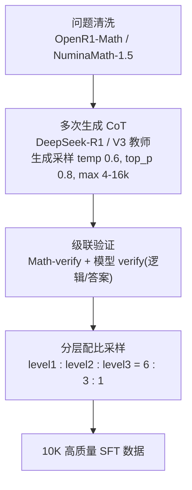
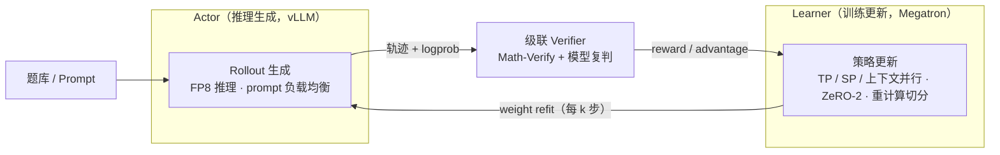

import Figure from '../../components/Figure.astro';

> 作为团队 LLM 推理 RL 方向的早期工作，从零搭建了三块可复用的能力：
>
> - **Zero-RL recipe**：不依赖 SFT、直接在 base 模型上做 RLVR。在 **Qwen2.5-Math-7B** 上将 5 项数学均分由 **30.6 提升至 54.6**（AIME24 46.7，高于 Oat-Zero 43.3、SimpleRL-Zoo 40）；在 **Qwen2.5-32B-Base** 上**复现 DAPO 报告的 AIME24 50 分**。
> - **冷启动 SFT 蒸馏 pipeline**：自建「清洗 → 多次生成 → 级联验证 → 配比采样」的蒸馏数据流程，用 **10K** 自蒸馏+验证数据使 Qwen2.5-32B-Base 达到 **70.5**（R1 蒸馏），逼近官方 R1-Distill-32B（**800K** 数据）的 74.2——以**不足 2% 的数据量**复现绝大部分蒸馏收益。
> - **自研推理 RL 训练框架**：SailSpeed-Reasoning（基于 OpenRLHF），完成 Actor/Learner 异步分离、长序列并行、k-step off-policy 等优化，相对 OpenRLHF 原生流程有吞吐优势；并为 **TIR（工具集成推理）**设计**流式 rollout**，在无开源指导下用 TIR 进一步拔高了 R1-Distill / Qwen3 等 reasoning model 的推理能力。

---

# 第一部分 · 方法与效果

## 1. 背景：从零建立推理 RL 能力

2025 年初 R1 发布后，团队启动 LLM Reasoning RL 方向。当时的目标明确：**先在公开数学推理任务上对齐复现业界 Zero-RL 的 SOTA**，沉淀出可迁移到内部业务的 recipe、冷启动数据 pipeline 与训练框架，再扩展到 TIR（工具集成推理）与游戏等真实业务场景。

本阶段的工作可归为四块：

- **Zero-RL recipe（§2）**：不依赖 SFT 冷启动、直接在 base 模型上做 RLVR，复现并超过开源 baseline，并把配方从 7B 放大到 32B，复现 DAPO 在 32B 上的结果。
- **冷启动 SFT 蒸馏 pipeline（§3）**：构建「问题清洗 → 多次生成 → 级联验证 → 配比采样」的蒸馏数据生产流程，用尽量少的数据复现官方大规模蒸馏的收益。
- **训练框架（§6）**：自研推理 RL 框架 SailSpeed-Reasoning（基于 OpenRLHF），完成 Actor/Learner 异步分离、长序列并行、k-step off-policy 等优化，相对 OpenRLHF 原生流程有吞吐优势；并针对 **TIR 场景**设计了流式 rollout 与自动 prefix caching。
- **游戏内应用（§7）**：把推理 RL 接入《元梦之星》行为树生成，用游戏环境作为可验证奖励，训练 7B 模型的多轮决策与演化能力——4 图平均通关率从 SFT 的 61.4% 提升到 100%，反超 Qwen3-235B（65.3%）。

评测口径：除特别说明外，下文 **5 项均分**指 AIME24 / MATH-500 / AMC23 / Minerva-Math / OlympiadBench 的平均 Pass@1，采用贪心解码（temperature = 0）、`qwen25-math-cot` 模板。

## 2. Zero-RL（数学）：复现并超过开源 baseline

### 2.1 7B：5 项均分 30.6 → 54.6

在 **Qwen2.5-Math-7B** 上做 Zero-RL，算法由 GRPO 逐步演进到 DAPO 配方（详见 §5）。最终结果超过同期主要开源 baseline：

<Figure
  src="/llm-reasoning-rl/zero7b-baselines.png"
  alt="7B Zero-RL 与开源 baseline 的 5 项均分对比"
  caption="灰=开源 baseline、蓝=本项目。base 模型 30.6；本项目 GRPO（仅 MATH 简单题）50.8，DAPO（自建难题为主）54.6，均高于 SimpleRL-Zero（48.8，港科大）、Oat-Zero（51.4，Sea AI Lab）与 SimpleRL-Zoo（53.3，港科大）。所有数值为各自最佳 checkpoint 的 5 项均分。"
/>

逐 benchmark 对照（5 项均分及主要单项，Pass@1 / t=0）：

| 模型 / 配置 | 训练数据 | **5 项均分** | AIME24 | MATH-500 | AMC23 | Minerva | Olympiad |
|---|---|---|---|---|---|---|---|
| Qwen2.5-Math-7B（base） | — | 30.6 | 23.3 | 53.0 | 45.0 | 15.4 | 16.3 |
| SimpleRL-Zero（港科大，PPO） | MATH 8.5K | 48.8 | 33.3 | 77.2 | 62.5 | 33.5 | 37.6 |
| Oat-Zero（Sea AI Lab，Dr.GRPO） | 中档题 | 51.4 | 43.3 | 80.0 | 62.7 | 30.1 | 41.0 |
| SimpleRL-Zoo（港科大，GRPO） | MATH 8.5K | 53.3 | 40.0 | 80.2 | 70.0 | 37.5 | 39.0 |
| **本项目 · GRPO**（100% 简单题） | MATH 8.5K | 50.8 | **46.7** | 78.4 | 57.5 | 33.1 | 38.4 |
| **本项目 · DAPO**（50% 自建难题 + 50% MATH） | MATH + 自建 20K | 53.2 | 36.7 | 83.0 | 72.5 | 46.7 | 45.3 |
| **本项目 · DAPO 续训**（90% 难题 + 10% 简单题） | 自建难题为主 | **54.6** | 40.0 | 83.0 | 72.5 | 47.4 | 45.3 |

> 关键判断：在与港科大 SimpleRL 系列**相同的初始模型**下，本项目通过**自建难题题库 + DAPO 配方**取得了更高的均分；**AIME24 单项达到 46.7，高于 Oat-Zero（43.3，Sea AI Lab）与 SimpleRL-Zoo（40，港科大）**。MATH-500 / AMC23 / Minerva / Olympiad 等需要较长推理的子集提升也最为明显，说明收益主要来自**对中高难度题的有效探索**，而非简单题上的拟合。（各开源 baseline 数值取自其公开博客 / 论文：SimpleRL-Reason 港科大 1/25 博客、Oat-Zero Sea AI Lab 3/21 paper、SimpleRL-Zoo 港科大 3/24 paper。）

训练过程中，5 项均分与平均回复长度同步上升——这是 Zero-RL 的典型信号：模型在 RL 过程中自发学会更长、更结构化的推理：

<Figure
  src="/llm-reasoning-rl/zero7b-curve.png"
  alt="7B Zero-RL 训练曲线：均分与回复长度随 episodes 变化"
  caption="蓝（左轴）=5 项均分 Pass@1，灰虚线（右轴）=平均回复长度。该曲线为连续训练全过程（MATH-8.5K GRPO 暖启 → 50/50 自建+MATH DAPO → 90/10 续训）。均分由 base 30.6 持续上升至 ~54，平均回复长度由 ~900 增长至 ~1600 token——分数提升与推理链增长同步发生。横轴为累计训练样本数（千）。"
/>

### 2.2 32B：Zero-RL 复现 DAPO 的 AIME24 50 分

把同一套 Zero-RL 配方放大到 **Qwen2.5-32B-Base**（仍是直接在 base 上做 RLVR、不做 SFT 冷启动）。结果如下（5 项均分及主要单项，Pass@1 / t=0）：

| 模型 / 配置 | 5 项均分 | AIME24 | MATH-500 | AMC23 | GSM8K |
|---|---|---|---|---|---|
| Qwen2.5-32B（base） | 30.5 | 3.3 | 57.2 | 35.0 | 83.6 |
| **本项目 · GRPO**（32B-Base Zero-RL） | 51.9 | 23.3 | 83.0 | 70.0 | 95.8 |
| **本项目 · DAPO**（32B-Base Zero-RL，best） | **57.3** | **50.0** | 85.2 | 80.0 | 96.1 |

> 关键结论：在 base 模型上直接 Zero-RL，均分由 30.5 提升至 57.3（单项峰值另达 64.9），**AIME24 触及 50——成功复现 DAPO 报告的 32B AIME24 50 分**。结合 §2.1，**这套 Zero-RL 配方在 7B 与 32B 上都能复现并对齐对应的开源 SOTA**（7B 超过 SimpleRL / Oat-Zero，32B 复现 DAPO）。

## 3. 冷启动 SFT 蒸馏 Pipeline：10K 数据逼近 800K 官方蒸馏

对需要冷启动的场景（例如基座本身不具备长链推理、或要快速注入某种能力），高质量 SFT 数据的**生产成本**是主要矛盾。为此自建了一套蒸馏-验证 pipeline，核心目标是**用尽量少的数据复现官方大规模蒸馏的收益**。本节只评估蒸馏本身的数据效率（与官方 distill 模型对比），不涉及后续 RL。

<Figure
  src="/llm-reasoning-rl/sft-coldstart.png"
  alt="冷启动 SFT 数据效率对比"
  caption="Qwen2.5-32B-Base 在不同 SFT 数据下的 5 项均分。base 30.5；用本 pipeline 产出的 10K 数据，V3 蒸馏达 51.4、R1 蒸馏达 70.5；官方 R1-Distill-32B（800K 全场景数据）为 74.2。<b>10K R1 蒸馏数据（&lt; 2% 数据量）即逼近 800K 官方蒸馏</b>。注：官方 R1-Distill 的 74.2 为带温度采样的复测均分，本项目 10K 模型为 t=0，口径略有差异，但数据效率的量级结论成立。"
/>

pipeline 由四步构成：

其中**级联验证**是质量的关键。对每条生成的 CoT，先用 `math_verify` 判定答案，再用模型 verifier（分「无参考」与「带参考解答」两套 prompt）独立判定**逻辑**与**最终答案**是否成立，并据此分层：

- **level 1**：逻辑与答案**全部**通过（最严格）；
- **level 2**：存在**逐条**逻辑且答案均成立的生成；
- **level 3**：仅模型 verifier 通过。

最终按 **6 : 3 : 1** 的比例从三层中采样，兼顾质量与难度覆盖。两点结论：

1. **教师质量决定上限**：相同 10K 数据量下，R1（长链推理教师）蒸馏达 70.5，显著高于 V3（短链教师）的 51.4——长思维链教师带来的提升远大于数据量边际。
2. **验证比数量更重要**：经级联验证精选的 10K 数据即可逼近 800K 官方蒸馏，说明在数学蒸馏中，**清洗 + 验证的数据质量**是比规模更高效的杠杆。

---

# 第二部分 · 关键问题与分析

> 本部分回答两个问题：**① Zero-RL 的 recipe 是如何一步步演进到 DAPO 的；② 数据配比、reduction 等关键变量各自的作用。**

## 4. baseline 对照：GRPO / PPO / DAPO 的差异

复现初期，先系统梳理了三套公开工作的设置差异，作为 recipe 设计的起点：

| 维度 | GRPO（DeepSeek） | SimpleRL（港科大） | DAPO（字节） |
|---|---|---|---|
| 算法 | GRPO | PPO | DAPO（GRPO 改进） |
| 框架 | — | OpenRLHF | verl |
| 初始模型 | — | Qwen2.5-Math-7B | Qwen2.5-32B |
| 数据 | — | 8.5K MATH（lv3–lv5） | 17K 竞赛题 |
| 关键手段 | 组内归一化 advantage | value-free、KL 约束 | clip higher、动态采样、token-level loss、overlong 惩罚、去 KL |

DAPO 的几项改动（clip higher 释放探索、token-level loss 平衡长短样本、去 KL 提效）与「在难题上做有效探索」的目标一致，因此被选作主配方。

### 4.1 我们实际采用的 DAPO 配方

7B 与 32B 的 Zero-RL 均基于 DAPO，具体启用了以下组件（沿用 DAPO 论文的设计，未对各组件单独做受控消融，此处仅说明采用了哪些）：

- **Clip Higher**：放宽重要性比率的上裁剪上界，给低概率但有价值的 token 更多被提升的空间，缓解熵过快坍缩。
- **去 reference KL**：移除 KL-to-ref 约束项，避免策略被牵向初始分布，释放探索空间、并节省一份 ref model 的前向开销。
- **Dynamic Sampling（动态采样）**：过滤掉一个 prompt 的 K 个 rollout 全对或全错（advantage 恒为 0、无梯度）的样本，把算力集中到有学习信号的样本上。
- **Token-level Loss**：以 token 为粒度做 loss reduction，而非按样本平均，避免长回复被稀释、平衡长短样本的梯度贡献。
- **Overlong 处理**：对超长（截断）回复做相应处理，避免被截断的不完整回复污染奖励。

工程侧的配套改动：**自建 prompt 模板**、调整 **max-position-embedding** 以支持更长上下文、以及训练流程中的 **mini-steps**（框架细节见 §6）。

> 需要说明：本阶段在这些 DAPO 单项配方上**没有做逐项的受控消融**——它们是作为一套成熟配方整体采用的。我们自己做了对照的只有两项：**数据配比**（简单题 vs 自建难题占比）与 **advantage 的 reduction 方式**（除方差 vs Dr.GRPO 不除方差），见 §5。

## 5. 实验演进：从 GRPO 到 DAPO 配方

最终 recipe 经由数据与算法两条线协同演进得到（5 项均分，best checkpoint）：

| 阶段 | 算法 / reduction | 数据配比 | 回复长度 | 5 项均分 | 继续演进的原因 |
|---|---|---|---|---|---|
| **GRPO** | GRPO，除方差，token-level | 100% MATH 简单题 | 2K | 50.8 | 简单题上限明显，难题覆盖不足 → 扩充难题题库 |
| **DAPO V0** | DAPO，除方差，token-level | 50% 自建难题 + 50% MATH | 6K | 53.2 | 难题占比偏低 → 提高难题比 |
| **DAPO 续训** | DAPO，除方差，token-level | 90% 难题 + 10% 简单题 | 6K | **54.6** | 最优；难题为主带来最大收益 |
| **DAPO（Dr.GRPO 变体）** | DAPO，**不除方差**，Dr.GRPO reduction | 90% 难题 + 10% 简单题 | 6K | 53.7 | 与除方差版整体相当，AIME24 单项更高（43.3）；作为对照保留 |

两条经验：

- **难题配比是主要杠杆**：题库由 100% MATH 简单题切换到「自建难题为主」后，Minerva / Olympiad 等难子集提升最明显（见 §2.1 表）。简单题易使策略快速饱和，难题才能持续提供有效梯度。
- **是否除方差（Dr.GRPO）影响有限**：在本数据与配方下，除方差与 Dr.GRPO reduction 的均分相当，差异主要体现在个别高方差 benchmark（如 AIME24）的单项波动上，并非主导因素。

---

# 第三部分 · 训练框架与应用落地

## 6. 自研推理 RL 框架与 TIR 流式 rollout

上述所有实验都跑在一套自研的推理 RL 训练框架 **SailSpeed-Reasoning**（基于 OpenRLHF）上。RL 训练的迭代速度由「rollout（推理生成）—训练更新」这条主循环的吞吐决定，因此框架优化是 recipe 能快速迭代的前提。本节先讲整体框架与相对 OpenRLHF 原生流程的优化，再讲针对 TIR 场景的专属设计。

### 6.1 整体框架：Actor / Learner 异步分离

框架将 **rollout（Actor，推理引擎）** 与 **训练（Learner，Megatron）** 解耦为两个可独立伸缩的角色，通过 weight refit 同步参数、以 k-step off-policy 控制二者的异步程度：

相对 OpenRLHF 原生流程，主要做了以下优化：

- **Actor / Learner 异步分离**：推理与训练解耦为独立角色、各自独立扩缩容，避免一方等待另一方造成的资源闲置。
- **长序列并行**：在 >16K 的长上下文下，组合使用 **Tensor / Sequence / 上下文并行 + ZeRO-2**，并自实现重计算的算子级切分，控制显存峰值。
- **FP8 推理**：rollout 侧采用 FP8，提升生成吞吐。
- **logprob 复用**：直接复用 rollout 阶段（推理引擎）已算出的 logprob 作为 `π_old`，省去训练侧的一次重复前向。**事后回看，这等价于无意中实现了 TIS（截断重要性采样）的雏形——用 rollout 策略的 logp 作为重要性比率分母**；但当时关注点是省一次前向的提效，并未意识到「训推 logp 不一致」这一问题本身（该问题在后续 VLM STEM RL 项目中才被系统定位与利用）。
- **Prompt 负载均衡**：按 prompt 长度调度，平衡各 DP rank 的推理耗时、削减长尾。
- **k-step off-policy**：允许 rollout 领先训练 k 步（k 步 on-policy 程度），在多轮 tool call 等长尾场景下显著提升整体吞吐——这也是支撑 TIR 的关键。

> 7B 实验在 16–32 张 H20 上即可于 1 天内完成一轮有效训练（bs=384 时约 1035 回复/卡/小时）。

### 6.2 TIR 场景专属优化：流式 Rollout

TIR（Tool-Integrated Reasoning，工具集成推理）让模型在推理中**穿插调用代码 sandbox**——「写代码 → 执行 → 读 interpreter 反馈 → 继续推理」，多轮交替直至给出最终答案：

<Figure
  src="/llm-reasoning-rl/tir-arch.png"
  alt="文本 RL vs 交织代码执行的 TIR 架构"
  caption="(a) 文本 RL：Policy LLM 一次性生成纯文本轨迹，整段计算 reward。(b) TIR：单条轨迹由<b>文本 / 代码 / interpreter 反馈</b>多轮交织而成，代码段被送入 <b>Code Sandbox</b> 执行、stdout 作为反馈拼回上下文，模型据此继续推理，最终结果再算 reward。相比纯文本推理，模型可借助代码做精确枚举、数值计算与算法求解。"
/>

TIR 的多轮 + sandbox 交互给 rollout 带来一个新问题：**每条轨迹的交互轮数与每轮等待时间高度不均**（有的题一轮出答案，有的要十几轮代码执行）。若沿用单轮生成的**离线 Batch 推理**模式，rollout 会被切成「逐轮同步」——每一轮都要等齐 batch 内最慢的那条轨迹才能进入下一轮，**总耗时累加为「每轮最大值之和」**，GPU 在每轮长尾上大量空转。流式 Rollout 去掉这个逐轮屏障，让每条轨迹独立连续推进自己的多轮，**总耗时降为「最慢单条轨迹」**：

<Figure
  src="/llm-reasoning-rl/streaming-rollout.png"
  alt="同步 batch（逐轮屏障）vs 流式 rollout（无屏障）的多轮总耗时对比"
  caption="4 条轨迹各做 3 轮生成，颜色深浅表示第 1/2/3 轮。(a) 同步 batch：每轮设屏障，必须等齐本轮最慢轨迹才进入下一轮，短轨迹空转等待（粉色阴影），<b>总耗时 = 各轮最大值之和（图中 10）</b>。(b) 流式 rollout：基于推理引擎的 in-flight batching，每条轨迹独立连续跑完自己的多轮、无屏障，<b>总耗时 = 最慢单条轨迹（图中 7）</b>。轮数与长尾越多，二者差距越大。"
/>

两项关键设计：

- **in-flight batching 异步调度**：每条轨迹独立推进多轮生成、验证循环，空出的 slot 立即回填新轨迹，把「每轮最大值之和」压缩为「最慢轨迹」，消除逐轮长尾等待。
- **自动 Prefix Caching**：多轮交互中，每一轮的输入都是上一轮上下文的延长，自动缓存公共前缀、减少重复 Prefill 开销。

> **TIR 实验设置**：128 卡 H20、训练 1 天；模型 Qwen3-14B，回复长度 16K，最多与 Python Interpreter 交互 16 轮；数据为 23K 题库（NuminaMath 按来源过滤采样 50K 题，R1 生成 5 条轨迹后按 Pass@1 均匀采样）；验证用级联 Math-Verify + Qwen Math Evaluator；算法 DAPO（动态采样 + Clip-Higher + 4K Overlong Buffer 软惩罚 + 无 KL Loss）。

### 6.3 TIR 效果：在无开源指导下，进一步拔高已是 reasoning model 的推理能力

值得强调的是，本阶段的 TIR 训练**没有可参照的开源工作或公开 recipe**——从流式 rollout 框架、数据配比到 reward 设计都是自行摸索的。即便如此，TIR 不仅能把 base 模型训出工具使用能力，还能在**已经具备强推理能力的 reasoning model（R1-Distill 系列、Qwen3 系列）**之上**进一步提升**：

- **Qwen2.5-7B-Base** 经 TIR Zero-RL 后，LiveCodeBench 达 **33.4**，逼近 **DeepSeek-R1-Distill-Qwen-7B（37.6）**——一个用纯文本长链蒸馏出来的强推理模型；
- **Qwen3-14B** 经 TIR 训练后，AIME24 达 **83.3**，在其本已很高的推理基线上继续抬升。

> 这说明：**工具集成推理是一条与「把文本链做长」正交的提升路径**——即使模型已经能写很长的正确推理链，让它学会在恰当时机调用代码做精确计算/枚举/搜索，仍能带来额外收益。

#### 行为演化：从「靠文本硬算」到「写代码求解」

训练中模型的行为发生了清晰的迁移。以同一道整除计数题（求三元组 (a,b,c) 使 a³+b³+c³ 被 3⁷ 整除的个数）为例，随 RL 推进，**该题的 Pass@1 从 0 持续上升到 78.1%**：

<Figure
  src="/llm-reasoning-rl/tir-evolution.png"
  alt="TIR 训练中同一道题的 Pass@1 随训练上升"
  caption="同一道整除计数题在 TIR 训练不同阶段的 Pass@1：iter 32 为 0%、iter 64 升至 15.6%、iter 96 达 78.1%。正确率的上升对应着下面三张截图所示的解题方式迁移。"
/>

而这三个阶段模型的**实际解题过程**如下——同一道题，从「纯文本手算」一步步走向「写代码求解」：

<Figure
  images={[
    { src: '/llm-reasoning-rl/tir-iter32.png', label: 'iter 32（Pass 0%）：纯文本逐 case 手算' },
    { src: '/llm-reasoning-rl/tir-iter64.png', label: 'iter 64（Pass 15.6%）：写代码先验证小规模 N(4)、找规律' },
    { src: '/llm-reasoning-rl/tir-iter96.png', label: 'iter 96（Pass 78.1%）：直接写出完整求解代码' },
  ]}
  cols={3}
  alt="同一道题在 iter 32 / 64 / 96 的解题过程"
  caption="<b>iter 32</b>：模型靠纯文本逐个枚举余数组合、手算取模，过程冗长且遗漏 case，最终答错（Pass 0%）；<b>iter 64</b>：开始借助代码，先对小规模子问题 N(4) 写代码计算、观察规律（code-assisted，Pass 15.6%）；<b>iter 96</b>：直接写出「预计算立方取模 + 计数」的完整代码、交 sandbox 执行得到正确答案（Pass 78.1%）。解题方式的迁移与正确率提升一一对应。"
/>

**进一步：自发动用高级算法（动态规划）。** 模型不止用代码做枚举，还会在合适的题上写出更高级的算法。下面这道博弈题（Alice/Bob 取石子，问有多少 n≤2024 让 Bob 必胜），模型自发用**动态规划**求解每个 n 的胜负态：

<Figure
  images={[
    { src: '/llm-reasoning-rl/tir-case-dp-problem.png', label: '题目：取石子博弈必胜计数' },
    { src: '/llm-reasoning-rl/tir-case-dp-code.png', label: '模型写出的 DP 求解代码' },
  ]}
  cols={2}
  alt="博弈题：模型自发用动态规划求解"
  caption="一道组合博弈计数题。模型没有套用文本推导，而是<b>自发写出动态规划</b>：以 dp[i] 表示剩 i 个石子时当前玩家是否必胜，递推后统计 Bob 必胜的 n 的个数。这类「识别问题结构 → 选择合适算法 → 写码求解」的行为，是纯文本推理难以稳定做到的。"
/>

## 7. 应用落地：游戏内的多轮推理 RL（GIR）

把前面沉淀的推理 RL 能力接入真实业务——**以游戏环境作为可验证奖励来源**，训练模型在游戏内做多轮决策与演化迭代。以《元梦之星》的**行为树（BT）生成**为切入：让 7B 思考模型替代原有的暴搜 + 大模型方案，作为游戏内 Local AI，并用 RL 优化其**多轮 Reflexion**（K=4 轮：根据上一轮对局结果与行为树访问统计，逐轮优化指定指标）的能力。

**建模**：第 1 轮从初始风格偏好/地图/目标指标生成行为树，正常完成对局（有击杀）+1、否则 −1；第 2–4 轮基于多轮历史观测，相对历史最优版本有改进 +1、否则 −1。游戏环境作为一种 verifier：CPU 部署、分钟级返回整局结果，既提供观测也提供结果奖励。

### 7.1 GIR 调度：用 (k-1)-step off-policy 掩盖分钟级的游戏验证延迟

游戏环境的验证（一整局对局）是**分钟级**的，远慢于生成与训练；若严格等每条轨迹对局结束再训练，GPU 会大量空转。为此设计了 **GIR（Game-Integrated Reasoning）调度**：让生成（R）与训练（T）的主循环与**分钟级的 gamecore 验证（V）并行重叠**。在 T_v ≈ (k-1)(T_r+T_t) 的情形下（k=3），训练用到的对局结果约滞后 k-1 步（**(k-1)-step off-policy**，约一半样本 on-policy），从而把游戏验证延迟掩盖在训练流水线之下。

<Figure
  src="/llm-reasoning-rl/gir-schedule.png"
  alt="GIR 游戏 RL 调度：生成/训练与分钟级 gamecore 验证并行"
  caption="蓝=生成（rollout，R）、橙=训练（T）、绿=gamecore 验证（V，游戏环境，分钟级）。生成连续推进、训练步穿插其间；<b>分钟级的游戏验证以 k=3 个并行 lane 错位调度</b>（V0/V3/… 一个 lane、V1/V4/… 一个、V2/V5/… 一个），每个 V 跨越约 k 个生成块（T_v ≈ (k-1)(T_r+T_t)）。因此第 i 步训练用到的对局结果约来自 k-1 步之前的 rollout——即 <b>(k-1)-step off-policy（约一半样本 on-policy）</b>。训练机器的全部 CPU 资源并行大量游戏实例、通过文件锁分配评估对局，行为树下发与结果聚合基于 Ray 的强 Spread 调度。"
/>

### 7.2 效果：7B RL 把通关率提到 100%，超过 Qwen3-235B

在该调度下训练，效果显著。把训练过程中随机采样的 rollout 轨迹按 SFT（回测）与 RL（实际 rollout）对比，**RL 模型生成的行为树通关率持续高于 SFT**，且在两者均可通关的对局上，RL 的目标指标也更优：

<Figure
  src="/llm-reasoning-rl/gir-rl-vs-sft.png"
  alt="游戏 RL vs SFT 通关率（滑动窗口）"
  caption="训练过程中随机采样 rollout 轨迹的滑动窗口指标（window=50）。<b>橙=RL 模型生成 BT 的通关率</b>、蓝=SFT 模型生成 BT 的通关率、绿=SFT/RL 均可通关时 RL 目标指标优于 SFT 的比例。随训练推进，RL 通关率稳定高于 SFT（约 90% vs 80%），且约 65% 的共同可通关对局上 RL 的待优化指标更好。"
/>

在最终评测（4 张地图平均通关率）上，**7B RL 模型把通关率从 SFT 基线的 61.4% 提升到 100%，不仅大幅超过 SFT，也超过参数量大得多的 Qwen3-235B（65.3%）与 Qwen3-4B（29.0%）**：

<Figure
  src="/llm-reasoning-rl/gir-completion.png"
  alt="游戏行为树生成：各模型 4 图平均通关率"
  caption="4 张地图平均通关率。7B SFT 基线 61.4%；Qwen3-4B 29.0%、Qwen3-235B 65.3%（直接用大模型生成行为树）；<b>7B RL 在 step 240 即达 99.9%、step 600 达 100%</b>。一个 7B 模型经游戏内 RL 后，在该任务上超过了 235B 的通用大模型——说明针对性的 RL 比单纯堆参数更有效。"
/>

这条线把数学推理 RL 的方法论（Zero-RL 配方、流式/异步调度、多轮 rollout）迁移到了**以游戏为可验证环境**的真实业务场景：用一个 7B 小模型替代暴搜 + 大模型方案、并通过 RL 优化其多轮行为树生成与演化能力，在通关率上达到 100% 并反超 235B 大模型。
